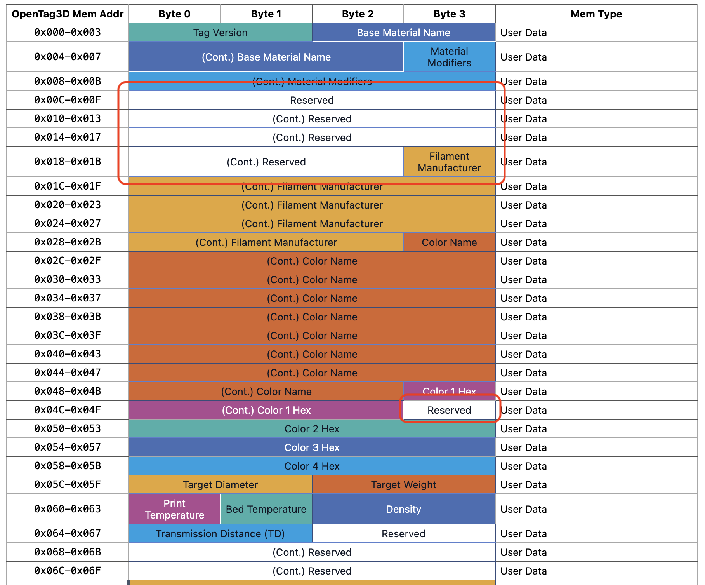

We're excited to announce that v2.0 of OpenTag3D is just around the corner, which introduces a better organized data structure and new inventory fields like SKU and UPC13/GTIN barcode, and makes the NTAG215 the minimum requirement for the data. Of course, reorganizing the data means breaking backwards compatibility, which may seem strange to do so quickly after v1.0 was released.

## What's the reason for the v2.0 release?

v1.0 was intended to establish a practical proof of concept and get the standard into the hands of early implementers. As adoption has grown, so has the number of people reviewing, testing, and contributing to the specification. v2.0 reflects that broader input and is intended to provide a significantly more stable foundation for the future.

We always anticipated that some early lessons might eventually require a break in backwards compatibility. With adoption accelerating, we believe it is better to make those necessary changes now, while the ecosystem is still relatively young, rather than later when substantially more manufacturers, hardware, and software depend on the existing format.

## Why restructure the data format?

As parameters were added, changed, and removed throughout the development of v1.0, existing parameters were intentionally left in place to preserve compatibility. Over time, this created gaps in the memory map and resulted in increasingly fragmented data. Since the changes planned for v2.0 already required breaking backwards compatibility, we took the opportunity to reorganize the existing parameters and make more efficient use of the available space.

We felt that if there was any time to fix it, it would be now while implementation is still in early stages, rather than months or years later when OpenTag3D tags are already deployed. Restructuring the data allowed us to improve a couple of existing fields -- such as the Transmission Distance field, which we learned only needed one byte; and the serial number, as filament manufacturers may want more than 16 characters.

## Why drop NTAG213 and SLIX2?

Another significant change in v2.0 is that NTAG215, or an equivalent or larger tag, is now the minimum supported capacity. The standard was designed to fit within the much tighter memory constraints of the NTAG213, which sometimes required compromises in how data was organized and left limited room for future expansion. Increasing the minimum capacity gives the format more freedom to organize data in a clear and intuitive way, while also leaving room for the standard to grow without immediately running into the same memory constraints.

## If v2.0 is coming out now, will v3.0 come out in another half year?

NO!

v2.0 is only releasing this quickly because OpenTag3D implementation is still in the very early stages. If implementation was established and v1.0 tags were widely deployed, we would not be releasing v2.0 so soon. In other words, we're trying to get ahead of the ball by making these changes early on, when the timing is just right.
